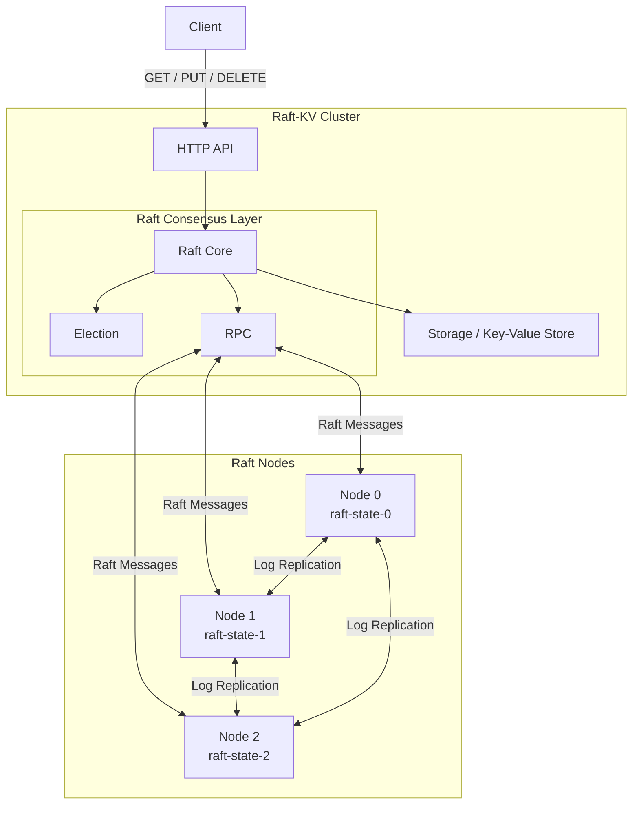

# raft-kv
Created by Diego Ongaro and John Ousterhout, the [Raft Consensus Algorithm](https://web.stanford.edu/~ouster/cgi-bin/papers/raft-atc14) is a leader-based consensus algorithm that manages replicated logs across servers in a distributed system. In Go, I built a key-value store using the Raft consensus algorithm by creating three nodes that elect a leader, replicate client logs  over TCP, and keep serving when a node dies. All logs are written to disk, ensuring that restarts will not erase committed data.

# How it works
**Leader Election**: 

**Log Replication**:

**Commiting**: 

# Simulating Election
**Requires Go 1.21+ to run.** In 3 individual terminals, run one of the commands.
```
go run . -id 0 -http localhost:9000
go run . -id 1 -http localhost:9001
go run . -id 2 -http localhost:9002
```

After a node wins the election, open a fourth terminal and run the following commands.
```
curl "http://localhost:9000/put?key=x&value=5"
curl "http://localhost:9000/get?key=x"
curl "http://localhost:9000/status"
```
The value 5 is stored within the key "x", as `/status` retrieves information about a node's term, role, commit index, and key-value history.

# Project Architecture 
```
raft-kv/
main.go         flags all nodes, acts as an entry point, defines node id

```

# Diagram of raft-kv


# References
Ongaro, Diego, and John Ousterhout. _In Search of an Understandable Consensus Algorithm_ 19 July 2014.

“Raft.” _Thesecretlivesofdata.Com_, 2026, https://thesecretlivesofdata.com/raft/. 

“Raft Consensus Algorithm.” _Raft.Github.Io_, https://raft.github.io/.
